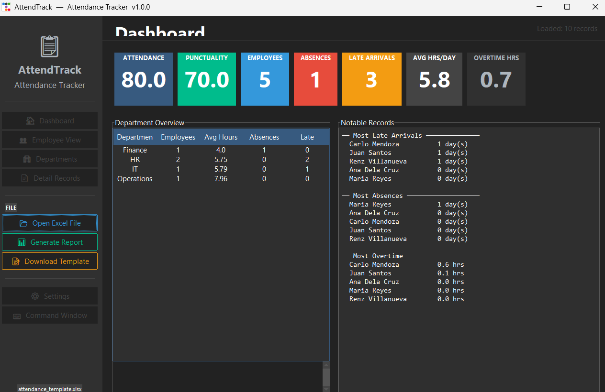

# AttendTrack — Employee Attendance Tracker

A professional desktop GUI app for reading, analyzing, and reporting employee attendance from Excel files.


---

## 📸 Preview

<p align="center">
  
</p>


---


## Requirements

```bash
pip install ttkbootstrap openpyxl pandas
```

Python 3.10+ required.

---

## How to Run

```bash
python main.py

# Auto-load a file on startup:
python main.py --file "C:/Users/Clent/Downloads/attendance.xlsx"
```

---

## Expected Excel Format

Your Excel file should have these columns (names are configurable in settings.json):

| Employee ID | Employee Name | Department | Date | Time In | Time Out | Status |
|---|---|---|---|---|---|---|
| E001 | Juan Santos | HR | 2025-06-01 | 08:05 | 17:10 | Present |

**Tip:** Use the **Download Template** button in the app to get a ready-made sample file.

### Accepted Status values:
- Present / P
- Absent / A
- Leave / L / On Leave
- Holiday / H
- Half Day / HD

---

## GUI Pages

| Page | Description |
|---|---|
| Dashboard | KPI cards, department overview, top lates/absences |
| Employee View | Sortable, searchable per-employee summary |
| Departments | Department-level aggregation |
| Attendance Detail | Full record table with late/absent highlighting |

---

## Command Window

Click **⌨️ Command Window** in the sidebar (or the button) to open a terminal-style panel. Available commands:

| Command | Description |
|---|---|
| `help` | List all commands |
| `load <path>` | Load an Excel file |
| `report` | Generate Excel report |
| `template <path>` | Save a sample template |
| `kpis` | Print current KPIs |
| `status` | Show loaded file info |
| `reload` | Reload current file |
| `clear` | Clear command window |

---

## Configuration — settings.json

### Key settings to customize:

**`app.theme`** — GUI theme. Options: `darkly`, `cyborg`, `vapor`, `superhero`, `solar`, `cosmo`, `flatly`, `litera`

**`attendance.work_start_time`** — When work officially starts (e.g. `"08:00"`)

**`attendance.late_threshold_minutes`** — Minutes after start time before someone is marked late (default: 15)

**`attendance.overtime_threshold_hours`** — Hours before overtime kicks in (default: 8.0)

**`report.company_name`** — Appears in the report header

**`excel.expected_columns`** — Map your Excel column names if they differ from defaults

---

